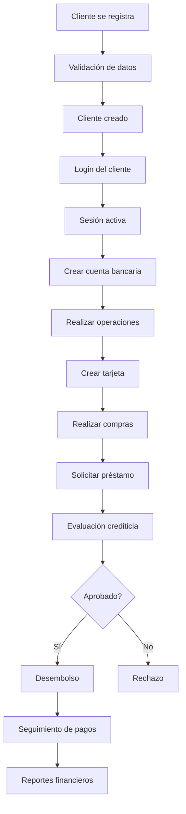

# 🏦 Sistema de Gestión Fintech

## Proyecto Integrador - Etapa 4

Un sistema completo de gestión financiera desarrollado con JavaScript vanilla, que incluye gestión de clientes, cuentas bancarias, tarjetas de crédito/débito, préstamos, movimientos financieros y una interfaz web moderna con sistema de enrutamiento avanzado.


## 📋 Tabla de Contenidos

- [Características](#-características)
- [Modelo de Negocios](#-modelo-de-negocios)
- [Tecnologías Utilizadas](#-tecnologías-utilizadas)
- [Estructura del Proyecto](#-estructura-del-proyecto)
- [Instalación y Uso](#-instalación-y-uso)
- [Clases del Sistema](#-clases-del-sistema)
- [Pruebas Unitarias](#-pruebas-unitarias)
- [API y Documentación](#-api-y-documentación)
- [Contribución](#-contribución)

## 🚀 Características

### ✨ Funcionalidades Principales
- **👤 Gestión Completa de Clientes**: Registro, validaciones robustas, gestión de datos personales
- **🏦 Cuentas Bancarias Avanzadas**: Múltiples tipos, límites diarios, historial completo
- **💳 Tarjetas de Crédito y Débito**: Gestión completa con límites, bloqueos y seguimiento
- **💰 Sistema de Préstamos**: Cálculo de cuotas, seguimiento de pagos, gestión de mora
- **📊 Reportes y Analytics**: Resúmenes financieros, estadísticas del sistema
- **🔐 Validaciones Robustas**: Validación exhaustiva de todos los datos de entrada
- **🧪 Suite de Pruebas Completa**: Más de 50 casos de prueba con cobertura completa
- **💾 Persistencia Avanzada**: Almacenamiento en localStorage con validación de integridad
- **🌐 Interfaz Web Moderna**: Sistema de enrutamiento SPA con navegación intuitiva
- **🎨 Diseño Responsivo**: Interfaz adaptativa con componentes modulares

### 🎨 Arquitectura del Sistema
- **Programación Orientada a Objetos**: Diseño modular y escalable
- **Separación de Responsabilidades**: Cada clase con responsabilidades específicas
- **Patrón Facade**: SistemaFintech como interfaz unificada
- **Validaciones Exhaustivas**: Control de datos en múltiples capas
- **Manejo de Errores**: Gestión robusta de casos edge y errores
- **Single Page Application (SPA)**: Enrutamiento del lado del cliente
- **Arquitectura de Componentes**: Interfaz modular y reutilizable
- **Diseño Responsivo**: Adaptación automática a diferentes dispositivos

## 🏗️ Modelo de Negocios

### Arquitectura de Clases

El sistema está compuesto por 6 clases principales que forman un modelo de negocios completo:

```
SistemaFintech (Orquestador Principal)
├── Cliente (Entidad Central)
├── Cuenta (Entidad Financiera Core)
├── Movimiento (Entidad Transaccional)
├── Tarjeta (Entidad de Pago)
└── Prestamo (Entidad Crediticia)
```

### Flujos de Negocio

1. **Registro y Autenticación**: Cliente se registra → Validación → Sesión activa
2. **Gestión de Cuentas**: Cliente solicita cuenta → Creación → Operaciones bancarias
3. **Gestión de Tarjetas**: Cliente solicita tarjeta → Asociación a cuenta → Compras
4. **Gestión de Préstamos**: Cliente solicita préstamo → Evaluación → Aprobación/Rechazo → Desembolso → Seguimiento

## 🛠️ Tecnologías Utilizadas

- **Frontend**: HTML5, CSS3, JavaScript ES6+
- **Almacenamiento**: LocalStorage API con validación de integridad
- **Testing**: Framework de pruebas personalizado con interfaz visual
- **Arquitectura**: Programación Orientada a Objetos (POO) con patrones de diseño
- **Validación**: Expresiones regulares y validaciones personalizadas en múltiples capas
- **Enrutamiento**: Sistema de routing del lado del cliente con hash navigation
- **UI/UX**: Diseño moderno con CSS Grid, Flexbox y animaciones CSS
- **Iconografía**: Font Awesome para iconos vectoriales
- **Responsive Design**: Media queries para adaptación móvil

## 📁 Estructura del Proyecto

```
📦 Proyecto Integrador Etapa 4
├── 📄 index.html                    # Página principal SPA con enrutamiento
├── 🎨 style.css                     # Estilos CSS modernos y responsivos
├── ⚙️ app.js                        # Lógica principal del frontend (Etapa 4)
├── 🛣️ router.js                     # Sistema de enrutamiento SPA (Etapa 4)
├── 👤 Cliente.js                    # Clase Cliente completa (Etapa 2)
├── 🏦 Cuenta.js                     # Clase Cuenta bancaria (Etapa 3)
├── 💳 Movimiento.js                 # Clase Movimiento transaccional (Etapa 3)
├── 💳 Tarjeta.js                    # Clase Tarjeta crédito/débito (Etapa 3)
├── 💰 Prestamo.js                   # Clase Prestamo crediticio (Etapa 3)
├── ⚙️ SistemaFintech.js             # Sistema principal integrado (Etapa 3)
├── 🧪 PruebasCompletas.test.js      # Suite completa de pruebas (Etapa 3)
├── 🖥️ test-runner-completo.html     # Interfaz visual para pruebas (Etapa 3)
├── 🖥️ test-runner.html             # Interfaz básica para pruebas (Etapa 2)
├── 🧪 Cliente.test.js               # Pruebas específicas de Cliente (Etapa 2)
├── ❌ error-cases-demo.html         # Demostración de casos de error
├── 📖 README.md                     # Este archivo (actualizado)
├── 📋 README-Etapa2.md              # Documentación específica de Etapa 2
├── 📋 README-Etapa3.md              # Documentación específica de Etapa 3
├── 📊 ModeloNegocios.md             # Diagrama y documentación técnica
├── 📋 RESUMEN-ETAPA3.md             # Resumen ejecutivo del proyecto
├── 📄 Proyecto Integrador Etapa 1.pdf  # Documentación original
└── 📸 CAPTURAS/                     # Capturas de pantalla del sistema
    ├── Test.png
    └── Test01.png
```

## 🚀 Instalación y Uso

### Requisitos Previos
- Navegador web moderno (Chrome, Firefox, Safari, Edge)
- No se requiere instalación de dependencias adicionales

### Instalación
1. **Clonar o descargar** el proyecto
2. **Abrir** `index.html` en tu navegador web para usar la aplicación principal
3. **Abrir** `test-runner-completo.html` para ejecutar las pruebas unitarias
4. **¡Listo!** El sistema está funcionando con interfaz moderna

### Uso de la Interfaz Web

#### 1. Acceso Inicial
- Abrir `index.html` en el navegador
- El sistema mostrará la pantalla de login por defecto
- Usar las credenciales de prueba o registrar un nuevo usuario

#### 2. Navegación
- **Login/Register**: Autenticación de usuarios
- **Dashboard**: Resumen financiero y actividad reciente
- **Perfil**: Gestión de datos personales
- **Cuentas**: Gestión de cuentas bancarias
- **Transferencias**: Realizar transferencias entre cuentas
- **Depósitos**: Simular depósitos de dinero
- **Tarjetas**: Gestión de tarjetas de crédito/débito
- **Préstamos**: Gestión de préstamos bancarios

#### 3. Funcionalidades Principales
- **Autenticación**: Login/registro con validaciones
- **Dashboard**: Vista general del estado financiero
- **Gestión de Cuentas**: Crear, ver y gestionar cuentas
- **Transferencias**: Transferir dinero entre cuentas
- **Simulación de Depósitos**: Depositar dinero en cuentas
- **Gestión de Tarjetas**: Crear y administrar tarjetas
- **Gestión de Préstamos**: Solicitar y gestionar préstamos
- **Notificaciones**: Sistema de toasts para feedback

### Uso del Sistema Completo

#### 1. Crear Sistema
```javascript
const sistema = new SistemaFintech();
```

#### 2. Registrar Cliente
```javascript
const cliente = sistema.crearCliente(
    'Juan', 'Pérez', '12345678', 
    'juan@email.com', 'password123'
);
```

#### 3. Crear Cuenta
```javascript
const cuenta = sistema.crearCuentaParaCliente(
    cliente.id, 1000, 'corriente'
);
```

#### 4. Realizar Operaciones
```javascript
// Depósito
sistema.realizarDeposito(cuenta.codigo, 500, 'Depósito inicial');

// Retiro
sistema.realizarRetiro(cuenta.codigo, 200, 'Retiro para gastos');
```

#### 5. Crear Tarjeta
```javascript
const tarjeta = sistema.crearTarjetaParaCliente(
    cliente.id, cuenta.id, 'credito', 'visa', 5000
);
```

#### 6. Realizar Compra
```javascript
sistema.realizarCompraConTarjeta(
    tarjeta.id, 100, 'Supermercado', 'Compra de alimentos'
);
```

#### 7. Solicitar Préstamo
```javascript
const prestamo = sistema.crearPrestamoParaCliente(
    cliente.id, 20000, 12, 15, 'personal', 'Compra de auto'
);

// Aprobar y desembolsar
sistema.aprobarPrestamo(prestamo.id, 'Cliente con buen perfil');
sistema.desembolsarPrestamo(prestamo.id, cuenta.codigo);
```

#### 8. Obtener Reportes
```javascript
// Resumen financiero del cliente
const resumen = sistema.obtenerResumenFinanciero(cliente.id);

// Estadísticas del sistema
const estadisticas = sistema.obtenerEstadisticasSistema();
```

## 📁 Clases del Sistema

### 1. **Cliente.js** (Mejorada desde Etapa 2)

**Características principales:**
- ✅ Validaciones exhaustivas (DNI, email, contraseñas, nombres)
- ✅ Gestión de cuentas bancarias asociadas
- ✅ Métodos de actualización de datos personales
- ✅ Control de estado (activo/inactivo)
- ✅ Serialización/deserialización JSON
- ✅ Validación integral con reporte de errores

### 2. **Cuenta.js** (Nueva)
```javascript
class Cuenta {
    // Gestión completa de cuentas bancarias
    // Depósitos y retiros con validaciones
    // Límites diarios por tipo de cuenta
    // Historial de movimientos
    // Resúmenes mensuales
}
```

**Características principales:**
- ✅ Tipos de cuenta: Corriente, Ahorro, Empresarial, Premium
- ✅ Límites de retiro diario configurables por tipo
- ✅ Validación de saldo suficiente
- ✅ Historial completo de movimientos
- ✅ Resúmenes mensuales automáticos
- ✅ Control de estado y activación/desactivación

### 3. **Movimiento.js** (Nueva)
```javascript
class Movimiento {
    // Representación de transacciones financieras
    // Validaciones de tipo y monto
    // Formateo de datos para presentación
    // Trazabilidad completa
}
```

**Características principales:**
- ✅ Tipos: Depósito, Retiro, Transferencia, Pago, Cobro
- ✅ Validación de montos y tipos
- ✅ Generación de referencias únicas
- ✅ Formateo de fechas y montos
- ✅ Cálculo de impacto en saldo
- ✅ Métodos de comparación y filtrado

### 4. **Tarjeta.js** (Nueva)
```javascript
class Tarjeta {
    // Gestión de tarjetas de crédito y débito
    // Generación de números válidos (algoritmo Luhn)
    // Control de límites y gastos diarios
    // Bloqueo/desbloqueo de tarjetas
}
```

**Características principales:**
- ✅ Tipos: Crédito y Débito
- ✅ Marcas: Visa, Mastercard, American Express
- ✅ Generación de números válidos con algoritmo Luhn
- ✅ Control de límites diarios
- ✅ Bloqueo/desbloqueo de tarjetas
- ✅ Enmascaramiento de números para seguridad
- ✅ Seguimiento de gastos mensuales

### 5. **Prestamo.js** (Nueva)
```javascript
class Prestamo {
    // Gestión completa de préstamos bancarios
    // Cálculo automático de cuotas (fórmula de amortización)
    // Seguimiento de pagos y mora
    // Estados del préstamo
}
```

**Características principales:**
- ✅ Tipos: Personal, Hipotecario, Automotriz, Empresarial, Educativo
- ✅ Cálculo automático de cuotas con fórmula de amortización
- ✅ Gestión de estados: Solicitado, Aprobado, Rechazado, Desembolsado
- ✅ Seguimiento de pagos y cuotas vencidas
- ✅ Cálculo de mora diaria
- ✅ Resúmenes de préstamo

### 6. **SistemaFintech.js** (Mejorada)
```javascript
class SistemaFintech {
    // Orquestador principal del sistema
    // Gestión de persistencia
    // Coordinación entre todas las clases
    // Reportes y estadísticas
}
```

**Características principales:**
- ✅ Gestión completa de todas las entidades
- ✅ Persistencia en localStorage con validación
- ✅ Autenticación y gestión de sesiones
- ✅ Reportes financieros por cliente
- ✅ Estadísticas generales del sistema
- ✅ Validación de integridad de datos
- ✅ Exportación/importación de datos

## 🧪 Pruebas Unitarias

### Suite Completa de Pruebas

El proyecto incluye una suite exhaustiva de pruebas unitarias con **más de 50 casos de prueba**:

#### 📊 Cobertura de Pruebas

- ✅ **Clase Cliente**: 6 casos de prueba
  - Creación con datos válidos
  - Validaciones de nombre, DNI, email
  - Gestión de cuentas
  - Serialización JSON

- ✅ **Clase Cuenta**: 6 casos de prueba
  - Creación y configuración
  - Depósitos y retiros válidos
  - Validaciones de saldo y límites
  - Resúmenes mensuales

- ✅ **Clase Movimiento**: 5 casos de prueba
  - Creación y validación
  - Verificación de tipos
  - Impacto en saldo
  - Formateo de datos

- ✅ **Clase Tarjeta**: 7 casos de prueba
  - Creación y validación
  - Compras válidas e inválidas
  - Bloqueo/desbloqueo
  - Enmascaramiento de números

- ✅ **Clase Prestamo**: 7 casos de prueba
  - Creación y validación
  - Cálculo de cuotas
  - Aprobación y rechazo
  - Registro de pagos

- ✅ **Clase SistemaFintech**: 10 casos de prueba
  - Gestión de clientes
  - Operaciones bancarias
  - Gestión de tarjetas y préstamos
  - Reportes y estadísticas

- ✅ **Pruebas de Integración**: 3 casos de prueba
  - Flujo completo de cliente
  - Persistencia de datos
  - Casos edge

- ✅ **Casos Edge**: 3 casos de prueba
  - Datos límite
  - Operaciones financieras especiales
  - Manejo de errores

#### 🚀 Ejecutar Pruebas

**Opción 1: Interfaz Web Completa**
1. Abrir `test-runner-completo.html` en el navegador
2. Hacer clic en "🚀 Ejecutar Todas las Pruebas"
3. Ver resultados detallados y estadísticas

**Opción 2: Consola del Navegador**
1. Abrir `test-runner-completo.html`
2. Abrir DevTools (F12)
3. Ejecutar: `ejecutarPruebasCompletas()`

**Opción 3: Framework de Pruebas**
```javascript
// Cargar todas las clases
// Ejecutar pruebas individuales
const test = new TestFramework();
test.run();
```

## 📊 Diagramas

### Diagrama de Clases (Mermaid)

El archivo `ModeloNegocios.md` contiene un diagrama completo de clases en formato Mermaid que muestra:

- **Relaciones entre clases**: Herencia, composición, asociación
- **Atributos principales**: Propiedades de cada clase
- **Métodos principales**: Funcionalidades de cada clase
- **Flujos de datos**: Cómo interactúan las clases

### Diagrama de Flujo de Negocio



## 🔧 API y Documentación

### API Completa

#### SistemaFintech
```javascript
// Gestión de Clientes
crearCliente(nombre, apellido, dni, email, password, telefono?, direccion?)
login(email, password)
logout()
getClientePorEmail(email)
getClientePorId(clienteId)

// Gestión de Cuentas
crearCuentaParaCliente(clienteId, saldoInicial?, tipoCuenta?)
getCuentasDeCliente(clienteId)
getCuentaPorCodigo(codigo)
realizarDeposito(codigoCuenta, monto, descripcion?)
realizarRetiro(codigoCuenta, monto, descripcion?)

// Gestión de Tarjetas
crearTarjetaParaCliente(clienteId, cuentaId, tipoTarjeta, marca, limiteCredito?)
getTarjetasDeCliente(clienteId)
getTarjetaPorId(tarjetaId)
realizarCompraConTarjeta(tarjetaId, monto, comercio, descripcion?)

// Gestión de Préstamos
crearPrestamoParaCliente(clienteId, montoSolicitado, plazoMeses, tasaInteres, tipoPrestamo, proposito?)
getPrestamosDeCliente(clienteId)
getPrestamoPorId(prestamoId)
aprobarPrestamo(prestamoId, observaciones?)
rechazarPrestamo(prestamoId, motivo)
desembolsarPrestamo(prestamoId, cuentaDestino)
registrarPagoPrestamo(prestamoId, monto, fechaPago?, observaciones?)

// Reportes y Analytics
obtenerResumenFinanciero(clienteId)
obtenerEstadisticasSistema()
validarIntegridadDatos()

// Utilidades
obtenerUsuarioActivo()
hayUsuarioActivo()
limpiarDatos()
exportarDatos()
importarDatos(datos)
```

### Validaciones Implementadas

#### Cliente
- **Nombre**: 2-50 caracteres, solo letras y espacios
- **Apellido**: 2-50 caracteres, solo letras y espacios
- **DNI**: 7-8 dígitos numéricos (acepta puntos y guiones)
- **Email**: Formato válido, máximo 100 caracteres, conversión a minúsculas
- **Password**: 6-50 caracteres

#### Cuenta
- **Saldo**: Números positivos, redondeo a 2 decimales
- **Tipo**: Corriente, Ahorro, Empresarial, Premium
- **Límites**: Retiro diario según tipo de cuenta
- **Montos**: Máximo $1,000,000 por transacción

#### Movimiento
- **Tipo**: Depósito, Retiro, Transferencia, Pago, Cobro
- **Monto**: Positivo, máximo $1,000,000
- **Descripción**: Máximo 200 caracteres

#### Tarjeta
- **Tipo**: Crédito, Débito
- **Marca**: Visa, Mastercard, American Express
- **Límite**: Máximo $1,000,000
- **Número**: Generación con algoritmo Luhn

#### Prestamo
- **Monto**: Máximo $5,000,000
- **Plazo**: Máximo 360 meses (30 años)
- **Tasa**: Máximo 50% anual
- **Tipo**: Personal, Hipotecario, Automotriz, Empresarial, Educativo

## 🌐 Etapa 4: Frontend Completo

### ✨ Nuevas Funcionalidades Implementadas

#### 🛣️ Sistema de Enrutamiento SPA
- **Router personalizado** (`router.js`) con navegación basada en hash
- **Múltiples vistas** integradas: Login, Register, Dashboard, Profile, Accounts, Transfers, Deposits, Cards, Loans
- **Navegación fluida** sin recarga de página
- **Estado de navegación** persistente con indicadores visuales

#### 🎨 Interfaz Moderna y Responsiva
- **Diseño moderno** con CSS Grid, Flexbox y variables CSS
- **Componentes modulares** reutilizables y escalables
- **Animaciones suaves** con transiciones CSS
- **Iconografía Font Awesome** para mejor UX
- **Adaptación móvil** completa con media queries

#### 🔐 Sistema de Autenticación Integrado
- **Login/Registro** con validaciones en tiempo real
- **Gestión de sesiones** integrada con SistemaFintech
- **Navegación condicional** basada en estado de autenticación
- **Feedback visual** con toasts y estados de carga

#### 📊 Dashboard Financiero Completo
- **Resumen financiero** con totales de cuentas y tarjetas
- **Actividad reciente** con últimos movimientos
- **Acciones rápidas** para operaciones comunes
- **Estadísticas visuales** del estado financiero

#### 🏦 Gestión Completa de Cuentas
- **Creación de cuentas** con diferentes tipos (Corriente, Ahorro, Empresarial, Premium)
- **Visualización detallada** con saldos y movimientos
- **Operaciones bancarias** integradas (depósitos, retiros)
- **Historial completo** de transacciones

#### 💸 Sistema de Transferencias
- **Transferencias entre cuentas** del mismo usuario
- **Validaciones completas** de saldo y límites
- **Confirmación visual** de operaciones
- **Registro automático** de movimientos

#### 💰 Simulador de Depósitos
- **Múltiples métodos** de depósito (Efectivo, Transferencia, Cheque)
- **Validaciones de monto** y tipo de cuenta
- **Simulación realista** de procesos bancarios
- **Actualización automática** de saldos

#### 💳 Gestión Avanzada de Tarjetas
- **Creación de tarjetas** de crédito y débito
- **Gestión de límites** y estados
- **Visualización de gastos** y saldos disponibles
- **Activación/desactivación** de tarjetas

#### 🏠 Gestión Completa de Préstamos
- **Solicitud de préstamos** con diferentes tipos
- **Seguimiento de estados** (Solicitado, Aprobado, Rechazado, Desembolsado)
- **Cálculo automático** de cuotas y saldos
- **Registro de pagos** y seguimiento de mora

#### 🔔 Sistema de Notificaciones
- **Toasts modernos** para feedback inmediato
- **Estados de carga** en botones durante operaciones
- **Mensajes contextuales** según el tipo de operación
- **Animaciones suaves** para mejor UX

#### 👥 Usuarios de Prueba Automáticos
- **Generación automática** de usuarios demo al iniciar
- **Datos preconfigurados** con cuentas, tarjetas y préstamos
- **Facilita testing** y demostración del sistema
- **Datos realistas** para mejor experiencia

### 🏗️ Arquitectura del Frontend

#### Estructura de Archivos
```
Frontend/
├── index.html          # Estructura SPA con múltiples vistas
├── style.css          # Estilos modernos y responsivos
├── app.js             # Lógica principal del frontend
└── router.js          # Sistema de enrutamiento
```

#### Patrones Implementados
- **Single Page Application (SPA)**: Navegación sin recarga
- **Component-Based Architecture**: Componentes modulares
- **Event-Driven Programming**: Manejo de eventos del DOM
- **State Management**: Gestión de estado de usuario activo
- **Separation of Concerns**: Separación clara de responsabilidades

#### Integración con Backend
- **SistemaFintech**: Integración completa con el modelo de negocios
- **LocalStorage**: Persistencia automática de datos
- **Validaciones**: Aprovechamiento de validaciones del backend
- **Error Handling**: Manejo robusto de errores del sistema

## 🎯 Objetivos del Proyecto

### Etapa 1 ✅
- [x] Diseño de clases POO básicas
- [x] Implementación de funcionalidades core
- [x] Interfaz web funcional
- [x] Persistencia en localStorage

### Etapa 2 ✅
- [x] Clase Cliente completamente desarrollada
- [x] Validaciones robustas implementadas
- [x] Suite de pruebas unitarias completa
- [x] Documentación técnica detallada
- [x] Casos de error cubiertos

### Etapa 3 ✅
- [x] **Modelo de negocios completo** con 6 clases principales
- [x] **Clase Cuenta** con funcionalidades bancarias avanzadas
- [x] **Clase Movimiento** para transacciones financieras
- [x] **Clase Tarjeta** para tarjetas de crédito y débito
- [x] **Clase Prestamo** para gestión crediticia completa
- [x] **SistemaFintech mejorado** como orquestador principal
- [x] **Suite de pruebas exhaustiva** con más de 50 casos
- [x] **Documentación técnica completa** con API detallada
- [x] **Diagrama de modelo de negocios** en formato Mermaid
- [x] **Interfaz de pruebas visual** moderna y funcional
- [x] **Validaciones robustas** en todas las capas
- [x] **Manejo de errores** profesional y descriptivo
- [x] **Casos edge** cubiertos exhaustivamente

### Etapa 4 ✅
- [x] **Sistema de enrutamiento SPA** con navegación del lado del cliente
- [x] **Interfaz web moderna** con diseño responsivo y componentes modulares
- [x] **Sistema de autenticación** integrado con login y registro
- [x] **Dashboard financiero** con resumen de cuentas y actividad reciente
- [x] **Gestión de cuentas** con creación, visualización y operaciones
- [x] **Sistema de transferencias** entre cuentas del usuario
- [x] **Simulador de depósitos** para ingresar dinero a las cuentas
- [x] **Gestión de tarjetas** con creación y administración completa
- [x] **Gestión de préstamos** con solicitud y seguimiento
- [x] **Sistema de notificaciones** con toasts modernos
- [x] **Diseño responsivo** adaptativo para móviles y tablets
- [x] **Integración completa** con el modelo de negocios existente
- [x] **Usuarios de prueba** automáticos para facilitar testing

### Próximas Etapas 🔮
- [ ] **Integración con APIs bancarias** reales
- [ ] **Sistema de notificaciones** (email, SMS)
- [ ] **Reportes avanzados** y analytics con gráficos
- [ ] **Seguridad avanzada** (hash de passwords, 2FA)
- [ ] **Base de datos persistente** (reemplazar localStorage)
- [ ] **API REST** para integración externa
- [ ] **Sistema de auditoría** y logging
- [ ] **Multi-moneda** y tipos de cambio
- [ ] **Machine Learning** para scoring crediticio
- [ ] **Integración blockchain** para transparencia


## 🤝 Contribución

### Cómo Contribuir
1. **Fork** el proyecto
2. **Crear** una rama para tu feature (`git checkout -b feature/AmazingFeature`)
3. **Commit** tus cambios (`git commit -m 'Add some AmazingFeature'`)
4. **Push** a la rama (`git push origin feature/AmazingFeature`)
5. **Abrir** un Pull Request

### Estándares de Código
- Usar **JavaScript ES6+**
- Seguir **convenciones de nomenclatura** consistentes
- Incluir **comentarios JSDoc** para métodos públicos
- Escribir **pruebas unitarias** para nuevas funcionalidades
- Mantener **compatibilidad** con navegadores modernos
- Documentar **cambios importantes** en el README

## 📄 Licencia

Este proyecto está bajo la Licencia MIT. Ver el archivo `LICENSE` para más detalles.

## 👨‍💻 Autor

**Desarrollador**: Ludmila Martos  
**Proyecto**: Sistema de Gestión Fintech - Proyecto Integrador  
**Etapa**: 4 - Frontend Completo con Enrutamiento SPA

## 📞 Contacto

- **Email**: [ludmilamartos@gmail.com](mailto:ludmilamartos@gmail.com)
- **LinkedIn**: [ludmimar89](https://www.linkedin.com/in/ludmimar89/)
- **GitHub**: [Ludmimar](https://github.com/Ludmimar)

---

<div align="center">

**⭐ Si te gusta este proyecto, ¡dale una estrella! ⭐**


</div>

