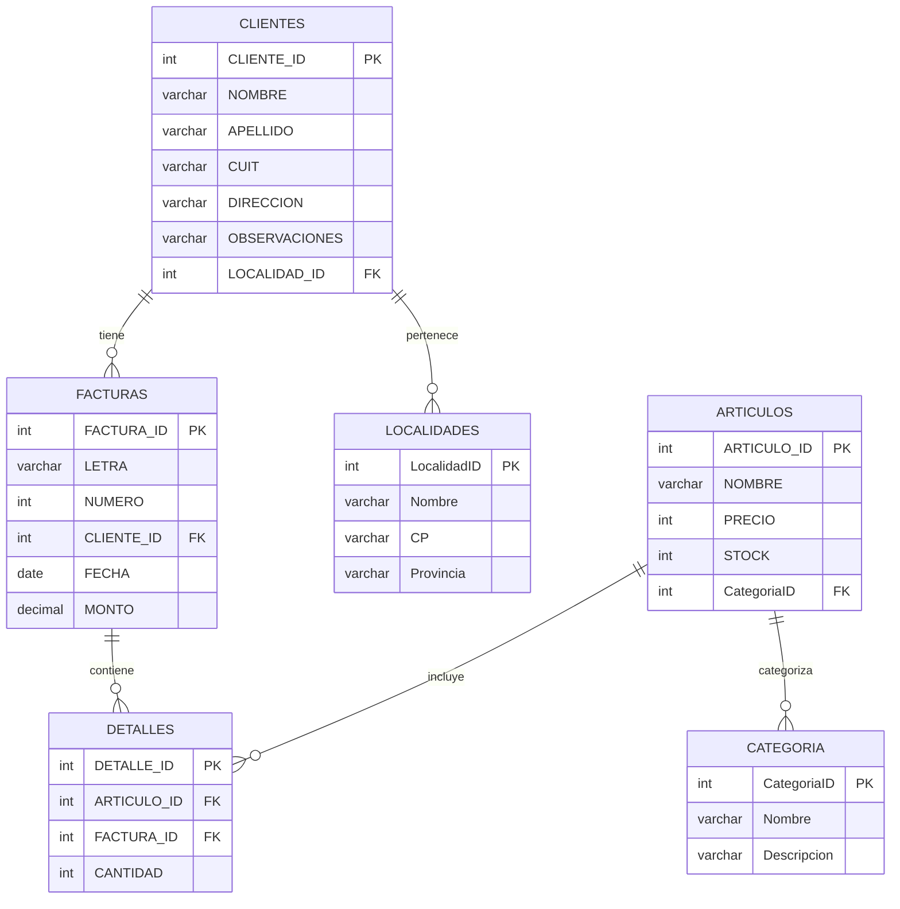

# Proyecto Integrador - Etapa 3
## Base de Datos TECNO_DB - Sistema de Gestión Comercial con Categorización

### 📋 Descripción del Proyecto

Este proyecto implementa una base de datos MySQL completa para un sistema de gestión comercial que incluye gestión de clientes, artículos, facturas, localidades y categorización de productos. El proyecto está estructurado en tres etapas principales que abarcan desde la creación de la base de datos hasta la organización completa de artículos por categorías.

---

## 🏗️ Estructura del Proyecto

```
Proyecto Integrador - Etapa 3/
├── README.md                           # Documentación principal
├── Paso1_ProyectoIntegrador.sql       # Script del Paso 1 (Etapa 2)
├── Paso2_ProyectoIntegrador.sql       # Script del Paso 2 (Etapa 2)
├── Paso3_ProyectoIntegrador.sql       # Script del Paso 3 (Etapa 2)
├── Etapa3_ProyectoIntegrador.sql      # Script completo de Etapa 3
├── Prompt_IA_Relacion_Clientes_Localidades.txt  # Prompt para relación CLIENTES-LOCALIDADES
├── Codigo_IA_Generado.sql             # Código generado por IA para relaciones
├── Prompt_IA_Detalles_Facturas.txt    # Prompt para tabla DETALLES
├── Codigo_IA_Detalles_Facturas.sql    # Código generado por IA para DETALLES
├── Prompt_IA_Categoria_Optimizacion.txt        # Prompt para optimización de tabla CATEGORIA
├── Prompt_IA_Inserts_Categorias.txt            # Prompt para generar inserts de categorías
└── Prompt_IA_Modificar_Articulos.txt           # Prompt para modificar tabla ARTICULOS
```

---

## 🗄️ Estructura de la Base de Datos

### Tablas Principales

#### 📍 **LOCALIDADES**
| Campo | Tipo | Descripción |
|-------|------|-------------|
| `LocalidadID` | INT (PK, AUTO_INCREMENT) | Identificador único |
| `Nombre` | VARCHAR(40) | Nombre de la localidad |
| `CP` | VARCHAR(10) | Código postal |
| `Provincia` | VARCHAR(20) | Provincia |

#### 👥 **CLIENTES**
| Campo | Tipo | Descripción |
|-------|------|-------------|
| `CLIENTE_ID` | INT (PK, AUTO_INCREMENT) | Identificador único |
| `NOMBRE` | VARCHAR(30) NOT NULL | Nombre del cliente |
| `APELLIDO` | VARCHAR(35) NOT NULL | Apellido del cliente |
| `CUIT` | VARCHAR(16) NOT NULL | CUIT del cliente |
| `DIRECCION` | VARCHAR(50) NOT NULL | Dirección del cliente |
| `OBSERVACIONES` | VARCHAR(255) | Observaciones adicionales |
| `LOCALIDAD_ID` | INT (FK) | Referencia a LOCALIDADES |

#### 📦 **ARTICULOS**
| Campo | Tipo | Descripción |
|-------|------|-------------|
| `ARTICULO_ID` | INT (PK, AUTO_INCREMENT) | Identificador único |
| `NOMBRE` | VARCHAR(75) NOT NULL | Nombre del artículo |
| `PRECIO` | INT UNSIGNED NOT NULL | Precio del artículo |
| `STOCK` | INT UNSIGNED NOT NULL | Stock disponible |
| `CATEGORIA_ID` | INT (FK) | Referencia a CATEGORIA |

#### 🧾 **FACTURAS**
| Campo | Tipo | Descripción |
|-------|------|-------------|
| `FACTURA_ID` | INT (PK, AUTO_INCREMENT) | Identificador único |
| `LETRA` | VARCHAR(1) NOT NULL | Letra de la factura |
| `NUMERO` | INT NOT NULL | Número de la factura |
| `CLIENTE_ID` | INT (FK) | Referencia a CLIENTES |
| `FECHA` | DATE NOT NULL | Fecha de la factura |
| `MONTO` | DECIMAL(10,2) UNSIGNED NOT NULL | Monto total |

#### 📋 **DETALLES**
| Campo | Tipo | Descripción |
|-------|------|-------------|
| `DETALLE_ID` | INT (PK, AUTO_INCREMENT) | Identificador único |
| `ARTICULO_ID` | INT (FK) | Referencia a ARTICULOS |
| `FACTURA_ID` | INT (FK) | Referencia a FACTURAS |
| `CANTIDAD` | INT NOT NULL | Cantidad del artículo |

#### 🏷️ **CATEGORIA**
| Campo | Tipo | Descripción |
|-------|------|-------------|
| `CategoriaID` | INT (PK, AUTO_INCREMENT) | Identificador único |
| `Nombre` | VARCHAR(50) NOT NULL | Nombre de la categoría |
| `Descripcion` | VARCHAR(255) | Descripción de la categoría |

---

## 🚀 Instrucciones de Instalación y Ejecución

### Prerrequisitos
- MySQL 5.7+ o MariaDB 10.3+
- Acceso administrativo a la base de datos

### Pasos de Instalación

#### 1️⃣ **Paso 1: Creación de Base de Datos y Estructura Inicial**
```bash
mysql -u root -p < Paso1_ProyectoIntegrador.sql
```
**Incluye:**
- Eliminación y creación de la base de datos `TECNO_DB`
- Creación de todas las tablas con sus estructuras
- Modificaciones de columnas según especificaciones
- Consultas de verificación inicial

#### 2️⃣ **Paso 2: Modificaciones y Relaciones**
```bash
mysql -u root -p < Paso2_ProyectoIntegrador.sql
```
**Incluye:**
- Modificaciones adicionales de tablas
- Establecimiento de relaciones entre CLIENTES y LOCALIDADES
- Consultas de verificación de relaciones

#### 3️⃣ **Paso 3: Carga de Datos**
```bash
mysql -u root -p < Paso3_ProyectoIntegrador.sql
```
**Incluye:**
- Carga de 5 localidades
- Carga de 5 clientes
- Carga de 4 artículos
- Carga de 5 facturas
- Consultas de verificación de datos

#### 4️⃣ **Carga de Detalles de Facturas**
```bash
mysql -u root -p < Codigo_IA_Detalles_Facturas.sql
```
**Incluye:**
- 15 registros en tabla DETALLES
- Distribución lógica de artículos en facturas
- Consultas de verificación y estadísticas

#### 5️⃣ **Etapa 3: Organización por Categorías**
```bash
mysql -u root -p < Etapa3_ProyectoIntegrador.sql
```
**Incluye:**
- Creación optimizada de tabla CATEGORIA
- 10 categorías para empresa de tecnología
- Modificación de tabla ARTICULOS con campo CategoriaID
- Relación entre ARTICULOS y CATEGORIA
- Consultas de verificación de categorización

---

## 📊 Datos de Prueba Incluidos

### Localidades (5 registros)
- CABA, Buenos Aires
- Rosario, Santa Fe
- Córdoba, Córdoba
- San Miguel de Tucumán, Tucumán
- Neuquén, Neuquén

### Clientes (5 registros)
- Santiago González (VIP)
- Gloria Fernández (GBA)
- Gonzalo López (GBA)
- Carlos García (VIP)
- Micaela Altieri (GBA)

### Artículos (4 registros)
- Webcam con Micrófono Plug & Play ($513.35)
- Apple AirPods Pro ($979.75)
- Lavasecarropas Automático Samsung ($1589.50)
- Gloria Trevi / Gloria / CD+DVD ($2385.70)

### Facturas (5 registros)
- Factura A28 - Gloria Fernández - $1589.50
- Factura A39 - Carlos García - $979.75
- Factura B8 - Gonzalo López - $513.35
- Factura B12 - Santiago González - $2385.70
- Factura B19 - Micaela Altieri - $979.75

### Categorías (10 registros)
- Componentes de PC - Procesadores, memorias RAM, placas madre, tarjetas gráficas
- Periféricos - Teclados, mouse, cámaras web, auriculares
- Software - Aplicaciones, sistemas operativos, licencias de software
- Redes y Conectividad - Routers, switches, cables de red, adaptadores WiFi
- Almacenamiento - Discos duros, SSD, memorias USB, tarjetas SD
- Impresión y Escaneo - Impresoras láser, inyección de tinta, escáneres
- Monitores y Pantallas - Pantallas LED, monitores gamer, pantallas profesionales
- Gaming - Accesorios para gaming como auriculares, sillas gamer
- Movilidad - Laptops, notebooks, tablets, smartphones
- Energía y Protección - UPS, baterías externas, estabilizadores

---

## 🔍 Consultas de Verificación

### Consultas Básicas
```sql
-- Mostrar todas las bases de datos
SHOW DATABASES;

-- Mostrar todas las tablas
SHOW TABLES;

-- Describir estructura de tabla CLIENTES
DESCRIBE CLIENTES;

-- Mostrar datos de clientes con sus localidades
SELECT 
    c.CLIENTE_ID,
    c.NOMBRE,
    c.APELLIDO,
    c.DIRECCION,
    l.Nombre as LOCALIDAD,
    l.Provincia
FROM CLIENTES c
LEFT JOIN LOCALIDADES l ON c.LOCALIDAD_ID = l.LocalidadID;
```

### Consultas Avanzadas
```sql
-- Resumen de ventas por cliente
SELECT 
    c.NOMBRE,
    c.APELLIDO,
    COUNT(f.FACTURA_ID) as CANTIDAD_FACTURAS,
    SUM(f.MONTO) as TOTAL_VENDIDO
FROM CLIENTES c
LEFT JOIN FACTURAS f ON c.CLIENTE_ID = f.CLIENTE_ID
GROUP BY c.CLIENTE_ID, c.NOMBRE, c.APELLIDO;

-- Artículos más vendidos
SELECT 
    a.NOMBRE,
    SUM(d.CANTIDAD) as TOTAL_VENDIDO,
    SUM(a.PRECIO * d.CANTIDAD) as TOTAL_RECAUDA
FROM ARTICULOS a
JOIN DETALLES d ON a.ARTICULO_ID = d.ARTICULO_ID
GROUP BY a.ARTICULO_ID, a.NOMBRE
ORDER BY TOTAL_VENDIDO DESC;

-- Artículos por categoría
SELECT 
    c.Nombre as CATEGORIA,
    COUNT(a.ARTICULO_ID) as CANTIDAD_ARTICULOS,
    SUM(a.STOCK) as STOCK_TOTAL,
    AVG(a.PRECIO) as PRECIO_PROMEDIO
FROM CATEGORIA c
LEFT JOIN ARTICULOS a ON c.CategoriaID = a.CategoriaID
GROUP BY c.CategoriaID, c.Nombre
ORDER BY CANTIDAD_ARTICULOS DESC;
```

---

## 🔗 Relaciones Entre Tablas



---

## 🛠️ Características Técnicas

### Modificaciones Implementadas
- **Campo MONTO**: Restricción `UNSIGNED` en tabla FACTURAS
- **Campo NOMBRE**: Expandido a 75 caracteres en tabla ARTICULOS
- **Campos PRECIO y STOCK**: Restricciones `UNSIGNED NOT NULL` en tabla ARTICULOS
- **Campos NOMBRE y APELLIDO**: Expandidos y con restricción `NOT NULL` en tabla CLIENTES
- **Campo COMENTARIOS**: Renombrado a `OBSERVACIONES` con 255 caracteres en tabla CLIENTES
- **Tabla CATEGORIA**: Creación optimizada con `AUTO_INCREMENT` y nombres consistentes
- **Campo CategoriaID**: Agregado a tabla ARTICULOS con valor por defecto 1

### Restricciones de Integridad
- Claves primarias en todas las tablas
- Claves foráneas con integridad referencial
- Restricciones `NOT NULL` en campos obligatorios
- Restricciones `UNSIGNED` para valores positivos
- Relaciones `ON DELETE SET NULL` y `ON UPDATE CASCADE`

---

## 📈 Estadísticas del Proyecto

| Métrica | Cantidad |
|---------|----------|
| **Archivos SQL** | 7 |
| **Tablas** | 6 |
| **Registros de Prueba** | 49 |
| **Relaciones** | 6 |
| **Consultas de Verificación** | 20+ |

---

## 🤖 Uso de Inteligencia Artificial

El proyecto incluye cinco implementaciones de IA:

1. **Relación CLIENTES-LOCALIDADES**: Prompt generado para establecer relaciones entre tablas
2. **Tabla DETALLES**: Prompt para generar 15 registros lógicos de detalles de facturas
3. **Optimización CATEGORIA**: Prompt para identificar errores y optimizar la tabla CATEGORIA
4. **Inserts CATEGORIA**: Prompt para generar 10 categorías para empresa de tecnología
5. **Modificación ARTICULOS**: Prompt para agregar campo CategoriaID a la tabla ARTICULOS

Los prompts están documentados en archivos separados para referencia y reutilización.

---

## 🆕 Novedades de Etapa 3

### ✨ Características Principales
- **Organización por Categorías**: Los artículos ahora están organizados en 10 categorías específicas para empresas de tecnología
- **Optimización de Estructura**: Corrección de errores en la tabla CATEGORIA y mejora de la consistencia de nombres
- **Relación Automática**: Todos los artículos existentes se asignan automáticamente a la categoría por defecto (ID: 1)
- **Integridad Referencial**: Nueva relación entre ARTICULOS y CATEGORIA mantiene la consistencia de datos

### 🔧 Mejoras Técnicas
- **Corrección de Sintaxis**: `IF EXISTS` → `IF NOT EXISTS`, `INT NOT` → `INT NOT NULL`
- **AUTO_INCREMENT**: Agregado a la clave primaria de CATEGORIA
- **Nomenclatura Consistente**: Nombres de columnas en mayúsculas para mantener consistencia
- **Valor por Defecto**: Campo CategoriaID con valor por defecto 1 para artículos existentes

### 📊 Categorías Implementadas
1. **Componentes de PC** - Hardware interno
2. **Periféricos** - Dispositivos de entrada/salida
3. **Software** - Aplicaciones y sistemas operativos
4. **Redes y Conectividad** - Equipos de red
5. **Almacenamiento** - Discos y memorias
6. **Impresión y Escaneo** - Equipos de oficina
7. **Monitores y Pantallas** - Displays y proyectores
8. **Gaming** - Accesorios para videojuegos
9. **Movilidad** - Dispositivos portátiles
10. **Energía y Protección** - UPS y estabilizadores

---

## 📝 Notas de Desarrollo

- Todos los scripts son compatibles con MySQL 5.7+ y MariaDB 10.3+
- Se incluyen consultas de verificación en cada paso
- Los datos de prueba son realistas y coherentes
- Las relaciones mantienen integridad referencial
- Código documentado con comentarios explicativos

---

## 👨‍💻 Autor

- **Desarrollador**: Ludmila Martos

## 📞 Contacto

-  [Email](ludmilamartos@gmail.com)
-  [Linkedin](https://www.linkedin.com/in/ludmimar89/)
-  [GitHub](https://github.com/Ludmimar)

---

